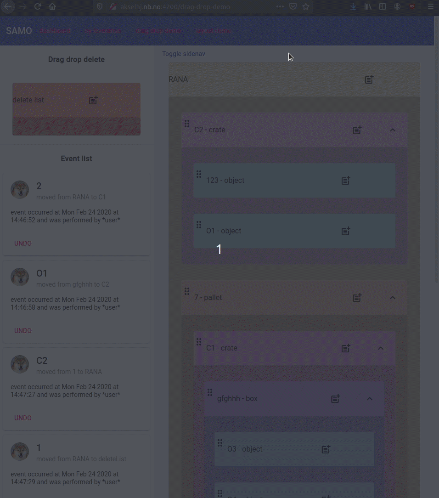

## SAMO-Prototype
This was a internal prototype at The national library of norway to mainly test drag and drop for touch interfaces, 
but also different aspects of angular, material, flex and websockets. Sadly some aspects of the code is not in english.

As this code will not be used in production I though it could help others that want to achieve some of the same 

## How to build and run
This project would be very hard to build and run and serves more as an example for people to dig in the code.
It depends on an external MySql database (REST-API) that was also a prototype. 
